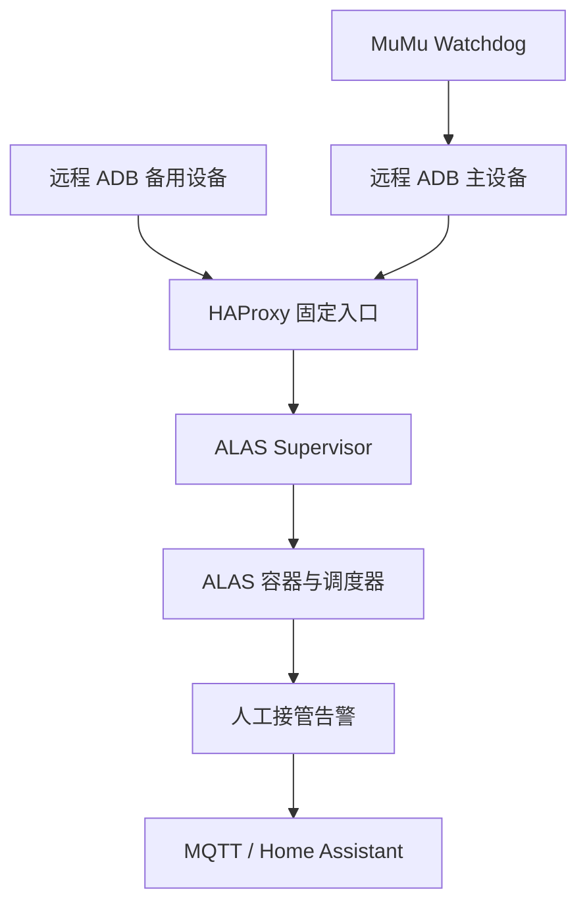

# ALAS Automation Toolkit

面向长期运行的 Docker 版 [AzurLaneAutoScript](https://github.com/LmeSzinc/AzurLaneAutoScript) 的恢复与运维工具集。

本仓库把 NAS 端监督、ADB 主备切换、人工接管告警、ALAS 调度器补丁，以及 Windows 端 MuMu Watchdog 放进同一套可审计的安装结构。所有设备地址、用户名、服务器名称、通知凭据和本地路径都必须由部署者自行配置；仓库不保存真实运行环境数据。

## 组件

| 目录 | 作用 |
|---|---|
| `nas/supervisor/` | 统一处理 ADB 恢复、ALAS 启动、维护期暂停与开服恢复 |
| `nas/scheduler-control/` | 为 ALAS 提供仅限本机的调度器状态、启动和暂停接口，并在 ALAS 更新后自动修复 |
| `nas/adb-failover/` | 使用 HAProxy 在主、备用远程 ADB 之间故障切换 |
| `nas/error-notify/` | 只在 ALAS 明确要求人工接管时，通过 MQTT 通知 Home Assistant |
| `nas/status/` | 一次汇总 systemd、进程、容器、ADB 主备与调度器状态 |
| `windows/mumu-watchdog/` | 检查 MuMu ADB、截图链路与实例进程，安全恢复无响应实例 |
| `home-assistant/` | MQTT 通知自动化示例 |



## 设计原则

- ALAS 永远只连接一个固定 ADB 入口，不直接依赖真实设备地址。
- 维护状态优先于 ADB 恢复，避免维护期间误启动调度器。
- 模拟器恢复必须连续多次通过健康检查，避免抖动造成重启风暴。
- 中间异常由 ALAS 自行恢复；只有最终人工接管标志才推送告警。
- MQTT、SMTP、OnePush、游戏账号和设备信息只保存在仓库外的 root-only 配置文件中。
- 安装器必须先备份、验证，再替换现有组件；失败时保留回滚路径。

## 隐私安全

提交前运行：

```bash
python3 tests/privacy_scan.py
```

扫描会拒绝真实内网地址、用户目录、主机名、服务器默认值、邮箱和疑似凭据。示例网络统一使用 RFC 5737 文档地址。

以下内容禁止提交：

- ALAS 的 `config/alas.json`、账号配置和 OnePush 字符串；
- `/etc/*.conf`、`.env`、MQTT/SMTP 密码或 Token；
- 日志、状态文件、错误截图、备份与计划任务导出；
- 真实 NAS/Windows 用户名、主机名、内网 IP、共享目录和游戏港区。

## 安装顺序

各组件可独立安装，完整部署建议按以下顺序进行：

1. `nas/adb-failover/`：生成 HAProxy 配置与独立 Compose overlay；
2. `nas/error-notify/`：创建 root-only MQTT 配置并启动实时告警；
3. `nas/scheduler-control/`：安装本地调度器接口与更新后修复 timer；
4. `nas/supervisor/`：启用统一监督并停用已被取代的旧服务；
5. `home-assistant/` 与 `windows/mumu-watchdog/`：按需部署。

每个安装器第一次运行都会先生成本地配置模板，不会把真实地址或凭据写回仓库。ADB 安装器不带 `--apply` 时只生成配置，不重建容器。

## 运维文档

- [运行状态检查](docs/runtime-status.md)
- [一键状态检查](nas/status/README.md)
- [隐私与发布边界](docs/privacy-and-publishing.md)
- [ADB 主备与当前端点查看](nas/adb-failover/README.md)
- [Supervisor 状态规则与冲突说明](nas/supervisor/README.md)

## 许可与关系

本项目采用 [MIT License](LICENSE)，是独立实现，并非 AzurLaneAutoScript、MuMu 模拟器、Home Assistant 或 Eclipse Mosquitto 的官方组件。本仓库不包含这些项目的源代码或二进制文件。
